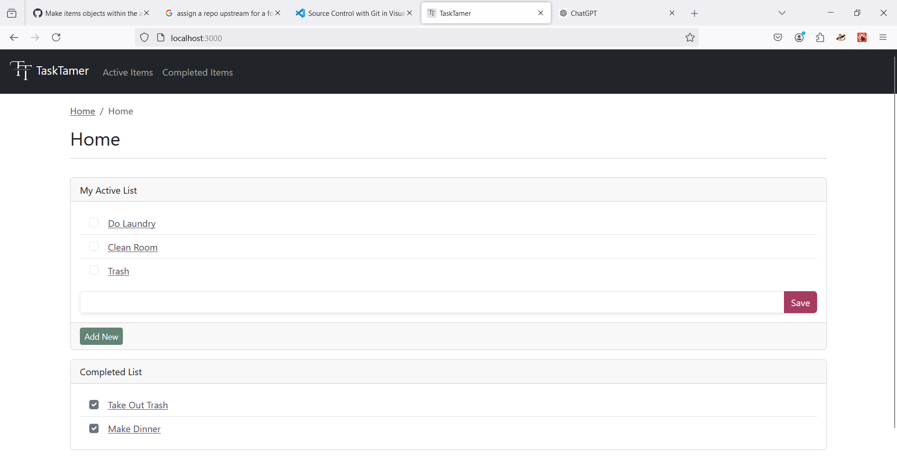

# TaskTamer   The best app to master your day one task at a time.

 

 <b>TaskTamer</b> is your ultimate to-do list app designed to help you organize, prioritize, and tackle your tasks with ease. Whether you're managing personal goals, collaborating on team projects, or simply keeping track of your daily to-dos, TaskTamer has you covered!

## Screenshot & Key Features

### Features

- <b>Interactive Task List:</b> Create tasks that are intuitive and easy to manage.
- <b>Task Details:</b> Expand tasks to add more information:

  - Assign them to individuals.
  - Set due dates to keep deadlines on track.
  - Break larger tasks into smaller, actionable subtasks.

- <b>Notes Section:</b> Add additional context or important details to your tasks to stay fully informed.

## Known Issues

This app is currently under development with features being developed in parts.

- Item details page is not dynamic
- Unable to edit tasks
- Checked items do not toggle between to active and completed
